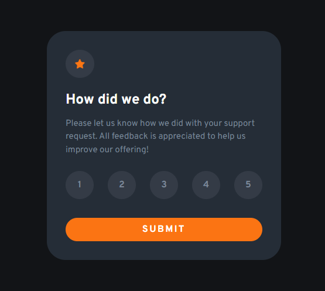
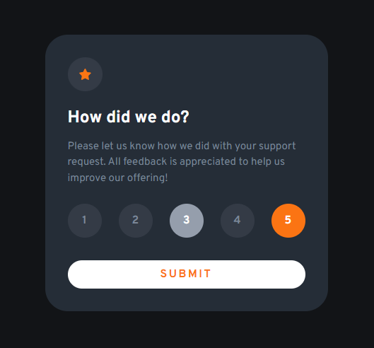
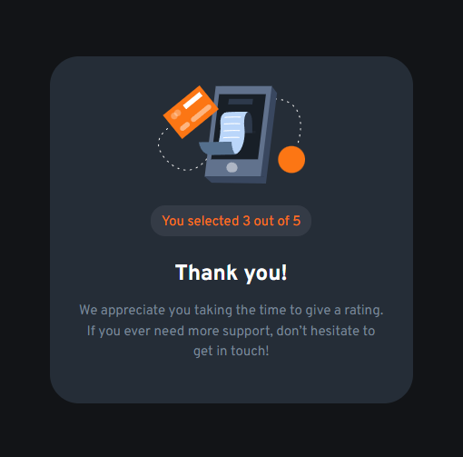

# Frontend Mentor - Interactive rating component solution

This is a solution to the [Interactive rating component challenge on Frontend Mentor](https://www.frontendmentor.io/challenges/interactive-rating-component-koxpeBUmI). Frontend Mentor challenges help you improve your coding skills by building realistic projects.

## Table of contents

- [Overview](#overview)
  - [The challenge](#the-challenge)
  - [Screenshot](#screenshot)
  - [Links](#links)
- [My process](#my-process)
  - [Built with](#built-with)
  - [What I learned](#what-i-learned)
  - [Continued development](#continued-development)
  - [Useful resources](#useful-resources)
- [Author](#author)
- [Acknowledgments](#acknowledgments)

## Overview

### The challenge

Users should be able to:

- View the optimal layout for the app depending on their device's screen size
- See hover states for all interactive elements on the page
- Select and submit a number rating
- See the "Thank you" card state after submitting a rating

### Screenshot





### Links

- Solution URL: [https://github.com/Grill3dCheese/FEM-RatingComponent](https://github.com/Grill3dCheese/FEM-RatingComponent)
- Live Site URL: [https://grill3dcheese.github.io/FEM-RatingComponent/src/](https://grill3dcheese.github.io/FEM-RatingComponent/src/)

## My process

### Built with

- Semantic HTML5 markup
- SASS/CSS custom properties
- Flexbox
- Mobile-first workflow
- Custom JavaScript
- NPM / package.json file

### What I learned

This project was extremely helpful in learning how to create a card with "two" sides. Which is really just one card with content that is hidden and different content shown upon user selecting rating and clicking submit button. I also used SASS for the first time in one of my Frontend Mentor projects! This was an excellent refresher on how to use NPM and the package.json file to create a script that I could run from the command line to watch for changes to SASS files and compile them to CSS files.

As well, this was my first Frontend Mentor project where I was able to implement a custom JavaScript file for interactivity!

```html
<div class="thanks hidden"></div>
```

```css
.star-icon img {
  animation: 5s infinite alternate rotate;
}

@keyframes rotate {
  from {
    transform: rotate(0deg);
  }

  to {
    transform: rotate(360deg);
  }
}
```

```js
submit.addEventListener("click", () => {
  if (numberPicked.textContent !== "") {
    ratingSide.classList.add("hidden");
    thanks.classList.remove("hidden");
  } else {
    alert("You must make a rating selection to continue!");
    preventDefault();
  }
});
```

### Continued development

- Continue learning all of the best practices when using SASS vs. CSS
- Continue JavaScript knowledge and pushing myself to understand confusing concepts

### Useful resources

- [Setting Up SASS Environment](https://www.youtube.com/watch?v=iJKCj8uAHz8&t=140s) - This is a tutorial I watched a few months back and I really liked the simplicity used to set up a SASS environment. This includes using NPM to install sass along with a few other packages. Also shows how to create a custom script we can run in our terminal which will watch changes to SASS files and auto-magically compile them to CSS files! 🪄

## Author

- Website - [Keith McKenna](https://www.keithmckenna.com)
- Frontend Mentor - [@Grill3dCheese](https://www.frontendmentor.io/profile/Grill3dCheese)
- Twitter - [@keithmckenna](https://www.twitter.com/keithmckenna)

## Acknowledgments

Thank you to freeCodeCamp.org for the video tutorial on how to set up a SASS environment! Link to video located under "Useful resources" section
